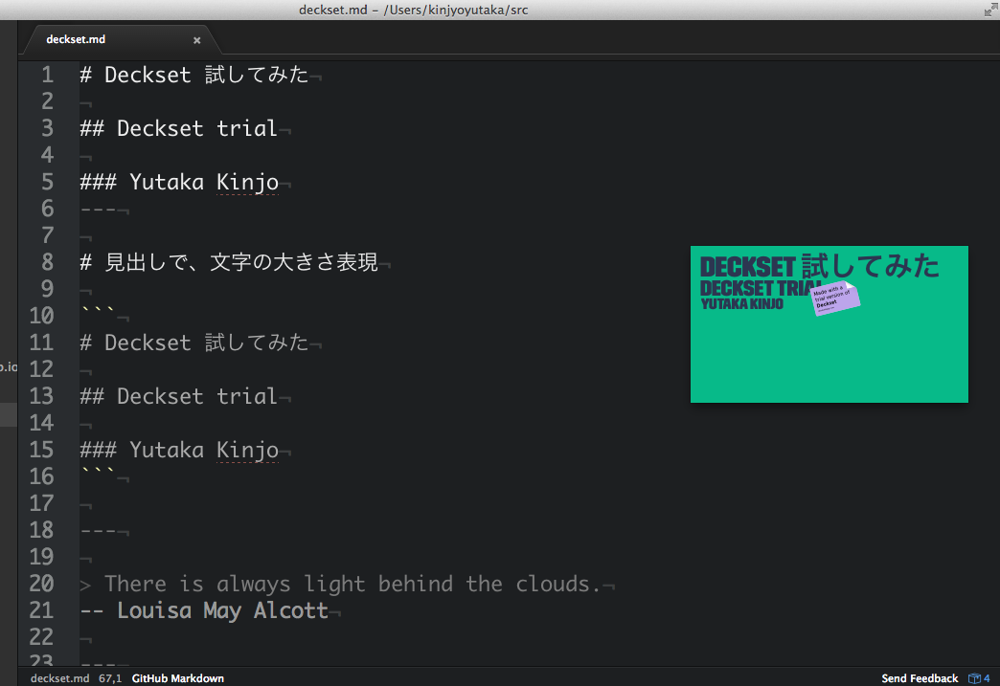

# Deckset 試してみた

## Deckset trial

### Yutaka Kinjo
---

# 見出しで、文字の大きさ表現

```
# Deckset 試してみた

## Deckset trial

### Yutaka Kinjo
```

---

> There is always light behind the clouds.
-- Louisa May Alcott

---

# 引用


```
> There is always light behind the clouds.
-- Louisa May Alcott
```

---

```c
#include<stdio.h>
int main(void) {
  printf("Hello Decset");
  return 0;
}
```

---

Syntax hight light

```
    ```c
    #include<stdio.h>
    int main(void) {
      printf("Hello Decset");
      return 0;
    }
    ```
```

---

# [fit]Bigger


----

# Slide 一杯に文字を表示する

`# [fit]Bigger`

----

# can use Atom editor



----


----

# ``


---

# ``


---

# ``


---

# ``

10% scale
 side text
# show Image inline

---

# image right

```

```


---

# image left

```

```


---

# emoji

## :+1: :zap: :bear:

---

# list

- list1
  - nest list2
    - ネストは2階層まで
- list3


1. num1
- num2
- num3

---

# tabel

|hoge|hoge|
|---|---|
|hoge|hoge|

## table は使えない

---

# markdown

- *strong*
- **under line**
- ~~strikethrough~~

---

# [fit] sounds good !!

---

# 考察 メリット
- メリット
  - markdown いいよね
    - 早く書ける
    - スライドなのにバージョン管理しやすい
  - 画像の扱いが楽
  - theme が豊富


---

# 考察 デメリット
- デメリット
  - 有料 $ 19.9
    - 流行りにくい
  - スライドの区切りが `---` なので、普通のmd表示と相性が悪い
  - 仕事用の本気のスライドには使えない(海外ならいける?)

---
# 買おうか悩む
- 明らかに Keynote より楽
- Glide より 書きやすい
- あとは使用頻度の問題

---

# [fit] End
